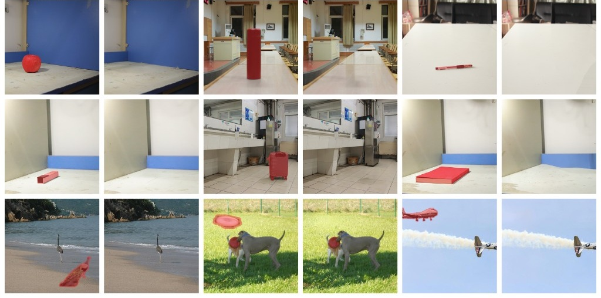
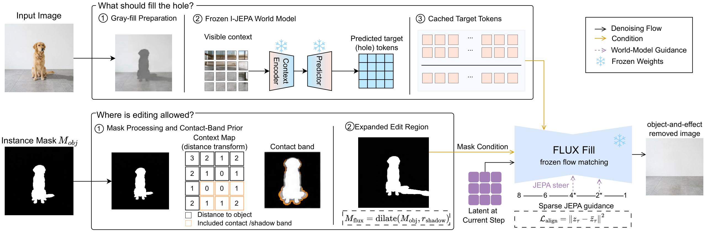
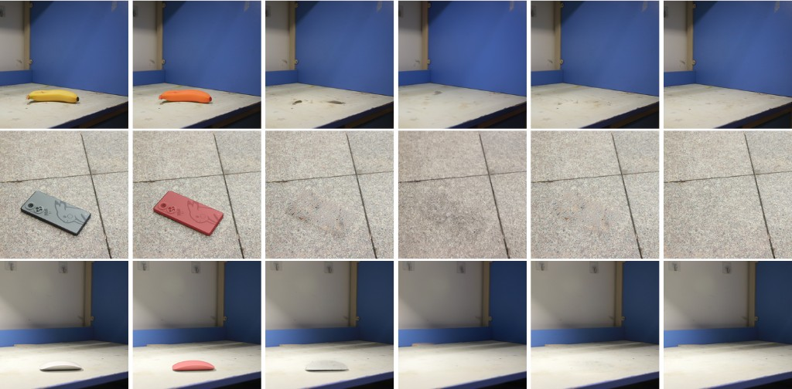

<div align="center">

# PredErase

**Training-Free Object-and-Effect Removal<br>with Predictive Latent Guidance**

[](https://arxiv.org/abs/2609.00956)
[](https://github.com/xiuwk0820-collab/PredErase)
[](LICENSE)
[](https://github.com/xiuwk0820-collab/PredErase)

[Waikit Xiu](https://github.com/xiuwk0820-collab)<sup>1</sup>&nbsp;&nbsp;
Qiang Lu<sup>2</sup>&nbsp;&nbsp;
Junbiao Chen<sup>2</sup>&nbsp;&nbsp;
Xiying Li<sup>2,*</sup>

<sup>1</sup>The University of Hong Kong&nbsp;&nbsp;
<sup>2</sup>Sun Yat-sen University<br>
[xiuwk0820@connect.hku.hk](mailto:xiuwk0820@connect.hku.hk) (Waikit Xiu)
&nbsp;·&nbsp;
<sup>*</sup>Corresponding author

[**Paper**](https://arxiv.org/abs/2609.00956)
&nbsp;·&nbsp;
[**Code**](https://github.com/xiuwk0820-collab/PredErase)
&nbsp;·&nbsp;
[**BibTeX**](#citation)



<em>Instance-only masks (red). PredErase removes the object together with cast shadows and contact shading — no paired training, no weight updates.</em>

</div>

---

Object-and-effect removal is not the same as filling a hole. A frozen inpainter constrained to \(M_{\mathrm{obj}}\) often leaves shadows and contact shading on the support. **PredErase** keeps **FLUX.2-klein-4B** and **I-JEPA ViT-H/14** frozen, and only steers latents at test time:

1. **Where to edit** — a contact-aware geometric prior expands the user mask into \(M_{\mathrm{flux}}\).
2. **What to reconstruct** — a cached I-JEPA hole prediction guides sparse projected updates inside that support.
3. **What not to touch** — packed-latent locking pins coordinates outside the editable region.

Evaluated on **RemovalBench**, **RORD-Val**, and **DEFACTO-Val** under the OmniEraser / SmartEraser protocols.

The Python package path remains `erase_world` (legacy import); the project name is PredErase.

<div align="center">

</div>
<p align="center"><em>Pipeline: gray-fill + frozen I-JEPA target (top), contact-band \(M_{\mathrm{flux}}\) (bottom), sparse guidance on frozen FLUX.2-klein-4B (center).</em></p>

## Qualitative

<div align="center">

</div>
<p align="center"><em>RemovalBench, instance-only masks. Left to right: Input, mask, native FLUX.2, OmniEraser, <b>ours</b>, clean plate.</em></p>

## Setup

```bash
git clone https://github.com/xiuwk0820-collab/PredErase.git
cd PredErase
python -m venv .venv && source .venv/bin/activate
pip install -r requirements.txt
huggingface-cli login   # accept FLUX.2-klein-4B
```

| Checkpoint | Source |
|------------|--------|
| FLUX.2-klein-4B | `black-forest-labs/FLUX.2-klein-4B` |
| I-JEPA ViT-H/14-1K | Meta `IN1K-vit.h.14-300e.pth.tar` → `./checkpoints/` or `~/.cache/erase-world/` |

Datasets (not shipped): see [`docs/DATA.md`](docs/DATA.md).

## Quick start

```bash
python scripts/run_inference.py \
  --config configs/default.yaml \
  --image examples/demo_image.jpg \
  --mask examples/demo_mask.png \
  --output outputs/demo.png
```

Seed-averaged inference (\(S=\{22,\ldots,26\}\), **not** best-of-5):

```bash
python scripts/run_inference.py ... --seed-average
```

### Benchmarks

```bash
python scripts/run_benchmark.py \
  --config configs/default.yaml \
  --dataset removalbench \
  --bench-root data/RemovalBench \
  --output-dir outputs/bench_rb_full \
  --seed-average
```

### Ablations & priors

```bash
python scripts/run_ablation.py --variant full --image ... --mask ... --output outputs/full.png
python scripts/run_ablation.py --variant native --image ... --mask ...
python scripts/run_ablation.py --variant wo_jepa --image ... --mask ...
python scripts/run_ablation.py --variant prior_clip --image ... --mask ...
python scripts/run_ablation.py --variant prior_dinov2 --image ... --mask ...
```

### Metrics

```bash
python scripts/compute_metrics_omnieraser.py \
  --dataset removalbench --bench-root data/RemovalBench \
  --pred-dir outputs/bench_rb_full/images

python scripts/compute_metrics_smarteraser.py \
  --dataset defacto --bench-root data/bench_extracted --bench-format folder \
  --pred-dir outputs/bench_defacto/images
```

Paper ↔ code map: [`docs/METHOD_ALIGNMENT.md`](docs/METHOD_ALIGNMENT.md) · reproduce: [`docs/REPRODUCE.md`](docs/REPRODUCE.md)

## Citation

```bibtex
@article{xiu2026prederase,
  title={PredErase: Training-Free Object-and-Effect Removal with Predictive Latent Guidance},
  author={Xiu, Waikit and Lu, Qiang and Chen, Junbiao and Li, Xiying},
  journal={arXiv preprint arXiv:2609.00956},
  year={2026},
  url={https://arxiv.org/abs/2609.00956}
}
```

## License

MIT License. Fill and I-JEPA checkpoints remain under their upstream licenses.

## Acknowledgements

We thank the authors of FLUX.2, I-JEPA, OmniEraser, and SmartEraser for models, benchmarks, and evaluation protocols.
